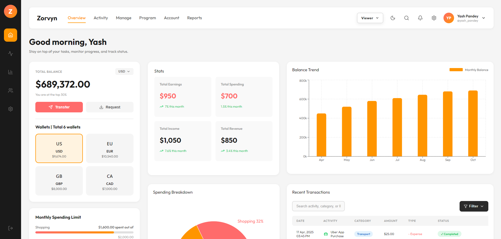
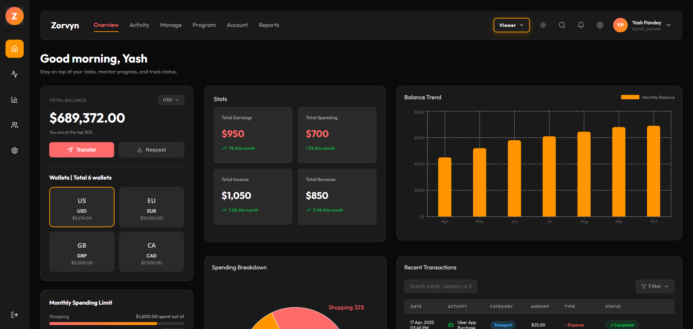

# Financial Dashboard (React + Vite)

A modern financial dashboard built with React and Vite, featuring analytics cards, interactive charts, transaction management, role-based controls, and dark/light visual themes.

## 1. Project Overview

This project is designed as a clean, data-heavy dashboard UI with a strong focus on:

- clear visual hierarchy for financial information
- smooth interactions for filtering and role-based actions
- modular component and stylesheet organization for maintainability
- theme support (light + dark)

## 2. Tech Stack

- React 18
- Vite 5
- Recharts (for charts)
- Lucide React (for icons)
- Modular CSS files under `src/styles`

## 3. Setup Instructions

### Prerequisites

- Node.js 18+ (recommended)
- npm

### Install

```bash
npm install
```

### Run development server

```bash
npm run dev
```

### Build for production

```bash
npm run build
```

### Preview production build

```bash
npm run preview
```

## 4. Approach and Structure

### Component-based architecture

UI is split into focused components:

- `Sidebar`, `Header`, `Greeting`
- `BalanceCard`, `SpendingLimitCard`, `MyCardsCard`
- `MetricsCard` (Stats)
- `BalanceTrendChart` (time-based visualization)
- `SpendingBreakdownChart` (categorical visualization)
- `RecentActivities` (search/filter/table/actions)

### State management approach

State is managed with React Context for shared app concerns:

- transaction data
- filter/sort/search state
- selected role (viewer/admin)

### Styling approach

- Modular CSS split by domain (layout, cards, charts, activities, theme)
- Grid-based dashboard layout for precise alignment
- Theme-aware styles for consistent dark/light behavior

## 5. Feature Highlights

- Dashboard cards for balances and metrics
- Balance Trend chart (orange bar chart)
- Spending Breakdown pie chart
- Recent Transactions with:
  - search
  - type filter
  - sort options
  - add/delete transaction actions (admin role)
- Role selector (Viewer/Admin)
- Dark/Light mode toggle
- Improved interactive behavior:
  - dropdown closes on outside click
  - hidden fallback table scrollbar styling

## 6. UI/UX Notes

The UI/UX focuses on clarity and smoothness:

- Strong card separation and spacing for scanability
- Consistent iconography and accent usage
- Smooth transitions on buttons, filters, and hover states
- High-contrast dark theme with improved sidebar icon visibility
- Reduced visual noise in charts (clean hover behavior, optional legend control)

## 7. Dark vs Light Theme Comparison

| Light Theme                               | Dark Theme                              |
| ----------------------------------------- | --------------------------------------- |
|  |  |

## 8. Future Improvements

- Persist transactions to backend/API
- Add pagination/virtualization for large transaction lists
- Export/import transaction data
- Add unit/UI tests
- Improve responsive table behavior for very small screens

---

If you want, I can also generate a `docs/` folder template with image placeholders and a pre-filled comparison section automatically.
